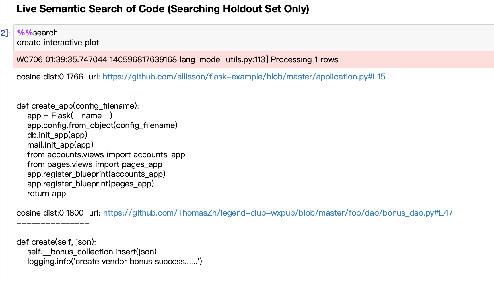

# README

## 实验记录

代码来源https://github.com/hamelsmu/code_search

#### 实验环境

- MacOS 10.14.5，8GB RAM
- Python 3.7.3

#### 实验步骤（docker）

1. 安装docker(`brew cask install docker`)，之后打开启动台里面的docker

2. `docker pull hamelsmu/ml-cpu`

3. `docker run -it -p 233:233 hamelsmu/ml-cpu bash`启动（注：之前试了6666端口不行，浏览器不能访问，可能是macos的设置？）

4. 获取代码：在docker中`git clone https://github.com/hamelsmu/code_search`

5. jupyter启动：启动docker之后`jupyter notebook --allow-root --no-browser --port 233 --ip=0.0.0.0`启动，复制网址到自己电脑的网页浏览器后将ip换成127.0.0.1就可以打开

6. 第一步（`1 - Preprocess Data`）：
    1. 减少数据量：手动下载数据集之后缩减，放到了`https://raw.githubusercontent.com/fengh16/2019SummerIntern/master/CodeSearch/test_little.csv`，可以把对应的获取数据集的代码改掉（改成`df = pd.read_csv(f'https://raw.githubusercontent.com/fengh16/2019SummerIntern/master/CodeSearch/test_little.csv')`）
    2. 运行代码前的操作：新建目录：`data/processed_data`
    3. 直接执行所有代码块就可以跑通第一步

7. 第二步（`2 - Train Function Summarizer With Keras + TF`）
    1. 安装没有的库tensorflow、annoy：直接pip安装（`pip install XXXX -i https://pypi.tuna.tsinghua.edu.cn/simple`）
    2. 调小seq2seq这里的batch_size：（改为100）避免内存不足
    3. 直接运行所有代码，跑通第二步

8. 第三步（`3 - Train Language Model Using FastAI`)
    1. 创建目录`data/lang_model`
    2. 将Train Fast.AI Language Model这里的文件名改成上面一个cell里面的带`_v2`的(应该是这样吧？)
    3. 修改fastai文件夹下的model.py文件，171和176行round参数的`values`改成`np.array(values).astype(float)`
    4. 创建目录`data/lang_model_emb`
    5. 直接运行所有代码，跑通第三步

9. 第四步（`4 - Train Model To Map Code Embeddings to Language Embeddings`）
    1. 调整`Train the code2emb Model`里面的batch_size（改成了200）和epoches（改成了4）
    2. 调整`Extract code vectors`里面的batch_size（改成了2000）
    3. 直接运行所有代码，跑通第四步

10. 第五步（`5 - Build Search Index`）

    1. 直接运行跑通

    2. 最下面的格子里面尝试了如下图：

        
